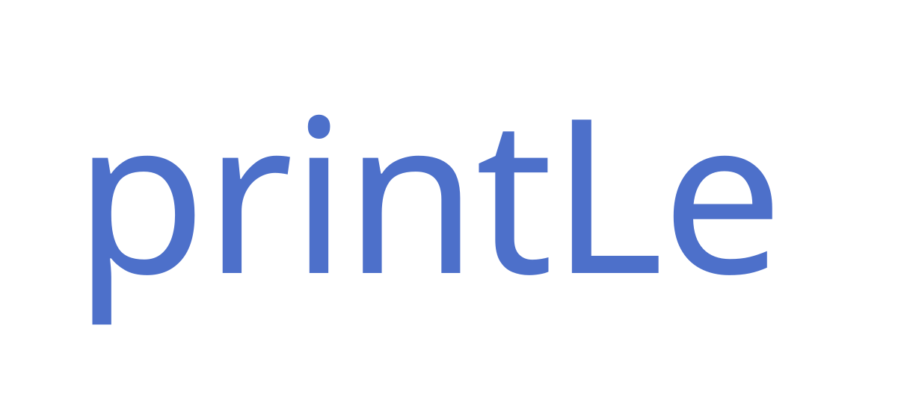

<h1 align="center">
  
</h1>

printLe is a self-hosted web print queue. Users upload PDFs, manage held jobs, and track their monthly page allowance. Administrators manage accounts, roles, quotas, and printer records from the same web interface.

This repository is a fresh rewrite. The previous Node implementation is preserved in the `legacy-v1.0` tag. `docs/legacy-v1.0.md` records what that version actually did, which bugs later commits fixed, and which behaviors must not return.

## Current scope

The current build includes:

- Local email and password authentication with Argon2id password hashes
- Secure server-side browser sessions and CSRF protection
- `ADMIN`, `OPERATOR`, `MANAGER`, and `USER` roles
- User and group administration, suspension, password resets, quota overrides, and adjustments
- PDF validation, page counting, held-job storage, cancellation, retry, and expiry
- CUPS-native job states, idempotent delivery, hardware duplex, and two-stage manual duplex
- CUPS printer discovery, capability-aware release, maintenance/error policy, and printer ACLs
- Monthly page allowances with individual/group/default precedence and transactional accounting
- Immutable per-job price estimates with versioned monochrome and color printer rates
- Usage reports and CSV export
- Append-only audit records for authentication, administration, and print operations
- PostgreSQL migrations with Flyway
- A responsive React interface with light/dark/system themes and selectable local fonts
- Configurable print/retention policy and dependency diagnostics
- Development CUPS queues for success, delay, cancellation, failure, hold, stop, capability, jam, and offline scenarios
- An internal token-protected print-node service and optional USB device mapping
- Application-consistent backup tooling for PostgreSQL, job files, and CUPS state
- Backend and frontend integration tests
- Production and development Docker Compose definitions with health checks and persistent service volumes

Hardware validation, stable udev/libusb enrollment, QR release, external OIDC, email invitations, and production hardening remain on the roadmap.

## Run with Docker Compose

Install Docker Engine with Docker Compose, then create the local configuration:

```bash
cp .env.example .env
```

Edit `.env` and replace both placeholder passwords. Start the application:

```bash
docker compose up -d --build
```

Open [http://localhost:8080](http://localhost:8080) and sign in with the bootstrap administrator configured in `.env`.

The bootstrap administrator is created only when the user table is empty. Changing its environment variables later does not change the existing account.

## Development

Run the frontend locally:

```bash
cd web
npm install
npm run dev
```

Run backend tests with the included Maven wrapper:

```bash
cd server
./mvnw test
```

Run the frontend checks:

```bash
cd web
npm test
npm run build
```

### Mock printing with CUPS

The development Compose overlay includes a real CUPS scheduler with controllable virtual printers for successful, delayed, canceled, aborted, held, stopped, jammed, offline, color, monochrome, duplex, and simplex behavior. It captures documents and submitted options without sending anything to physical hardware.

See [`cups/mock/README.md`](cups/mock/README.md) for startup, submission, and inspection commands.

## Data

Compose stores PostgreSQL data and uploaded PDFs in named volumes. Uploaded files are accepted only when they have a PDF header and can be parsed by PDFBox. The default upload limit is 25 MB.

Back up the database, job files, and CUPS state together. See [`docs/backup-and-restore.md`](docs/backup-and-restore.md).

## Security notes

- Do not expose the development configuration to the internet.
- Put production deployments behind HTTPS and set `PRINTLE_SECURE_COOKIES=true`.
- Replace every placeholder secret in `.env`.
- The web service is the only published container. PostgreSQL and the API stay on an internal Compose network.
- There is no public registration endpoint.

The project license is still undecided. Do not accept outside contributions until the community and commercial licensing model is settled.
